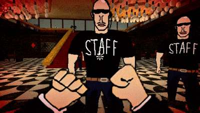
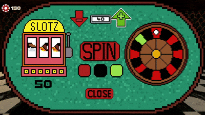
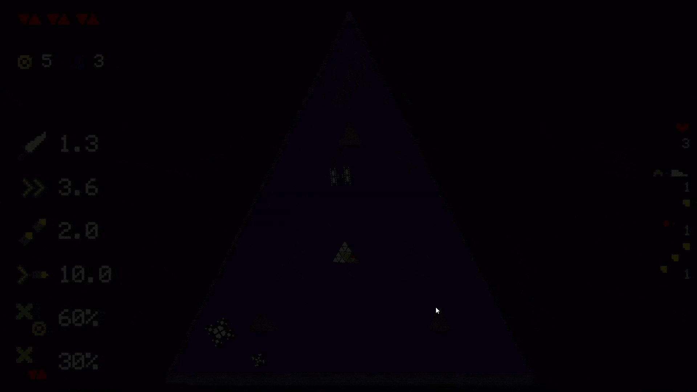
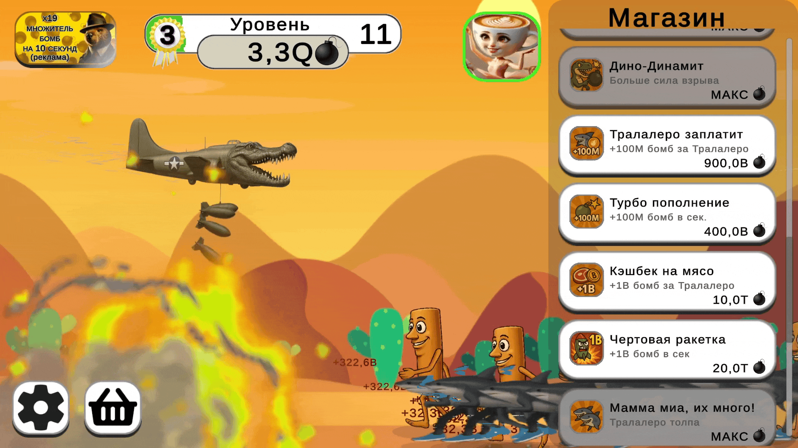
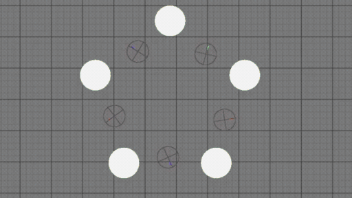
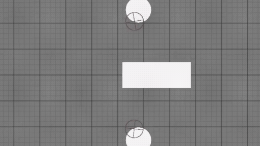
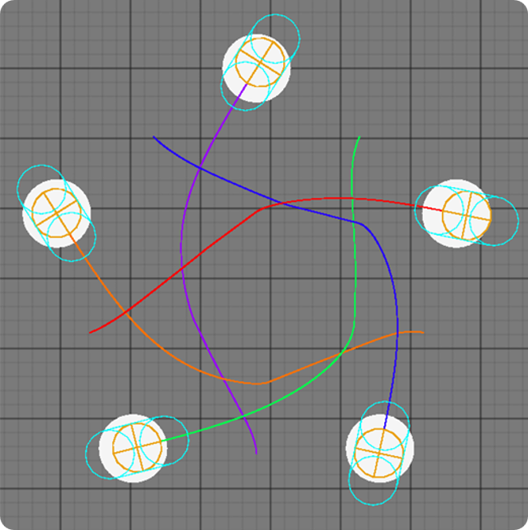
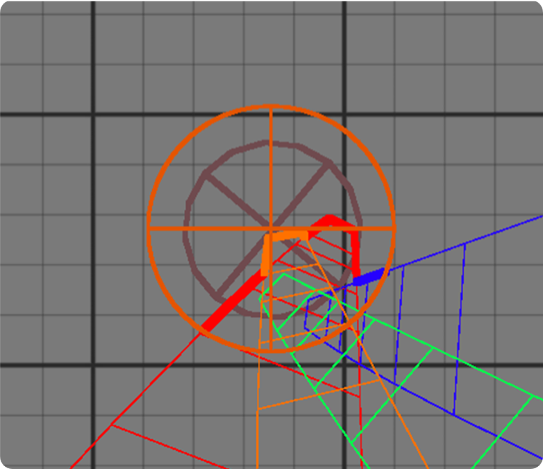
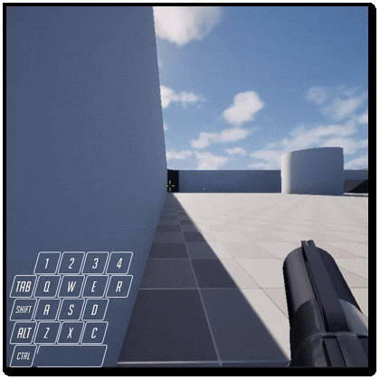
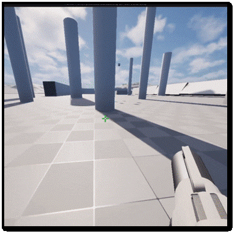

**Junior Gameplay & Systems Programmer**

### Soul Overcharge — 2.5D Arcade Racing

  
  

---

### All In — 3D Arena Slasher

  
  

---

### Silly Fractals — 2D Roguelike

  

---

### Победи их всех: Бомбардиро VS Тралалеро — Idle Clicker (Релиз)

  

---

### Advanced AI & Navigation System (Unreal Engine 5, C++)

<table>
  <tr>
    <td></td>
    <td></td>
  </tr>
  <tr>
    <td></td>
    <td></td>
  </tr>
</table>

---

### First-Person Action Mechanics (Unreal Engine 5, C++, Blueprints)

  
  

