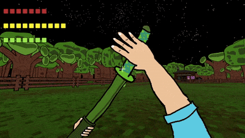

**Junior Gameplay & Systems Programmer**

## Избранные проекты

### Soul Overcharge — 2.5D Arcade Racing
Продвинутая аркадная гонка с кастомной симуляцией физики и строгой DI-архитектурой.

  

**Технические хайлайты:**
*   Спроектировал архитектуру на базе **VContainer (DI)**, полностью отказавшись от синглтонов.
*   Реализовал **State Machine** через фабрики состояний для управления поведением AI-противников (преследование, параллельное движение, атака) и контроллера игрока (Drive, Drift).
*   Написал кастомную симуляцию физики авто: расчет оборотов (RPM), крутящего момента, сопротивления двигателя и симуляция коробки передач.
*   Разработал **Editor-инструменты** для генерации дорог по сплайнам и визуализации графиков ускорения.
*   Интегрировал звуковой движок **FMOD** для динамического изменения звука двигателя в зависимости от RPM.

---

### All In — 3D Arena Slasher
Динамичный экшен от первого лица.

  
  

**Технические хайлайты:**
*   Создал комплексный FPS-контроллер с физической симуляцией (импульс, трение, Wall-Jump, Dash, Coyote Time) и системой крюка-кошки.
*   Реализовал ИИ босса и врагов на базе **Animator StateMachineBehaviour** для идеальной синхронизации логики нанесения урона с кадрами анимации.
*   Спроектировал систему ближнего боя с очередью ввода (**Input Buffering**) для плавного выполнения комбо-ударов.
*   Написал кастомные Image Effects для стилизации рендера (Bayer Dithering, пикселизация, подмена палитры).

---

### Silly Fractals — 2D Roguelike
Процедурно-генерируемый roguelike с глубокой системой характеристик и мета-прогрессией.

  

**Технические хайлайты:**
*   Разработал масштабируемую систему статов (RPG Stats), поддерживающую базовые значения и стакающиеся мультипликаторы.
*   Построил архитектуру лута и баффов на базе полиморфизма и делегатов (C# Actions/Func), позволяющую легко добавлять новые предметы и мутации врагов.
*   Использовал асинхронное программирование (**async/await**, `Task`) для управления таймингами эффектов и анимациями подбора лута.

---

### Победи их всех: Бомбардиро VS Тралалеро — Idle Clicker (Релиз)
Коммерческий проект, успешно доведенный до релиза на платформе Яндекс.Игры.

  

**Технические хайлайты:**
*   Реализовал полный цикл разработки и интеграцию **Yandex Games SDK** (облачные сохранения, Rewarded Ads, лидерборды).
*   Внедрил систему **Object Pool** для оптимизации памяти при массовом спавне частиц.
*   Спроектировал значительную часть интерфейса игры.
